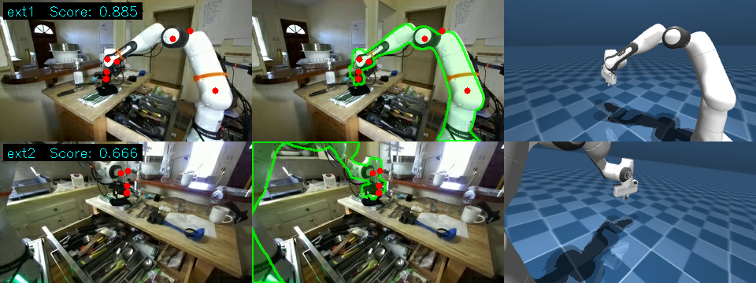
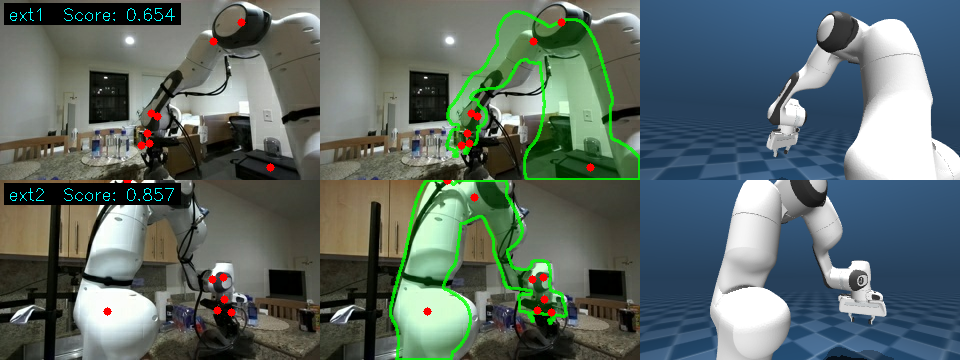
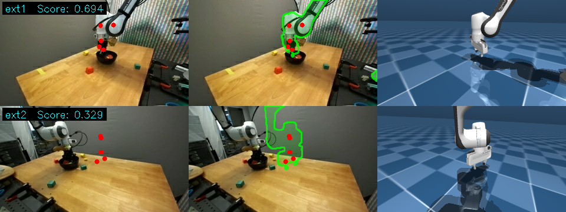

# DroidCalib

Camera calibration quality filtering for the [DROID](https://droid-dataset.github.io/) dataset. Renders Franka Panda via MuJoCo off-screen using calibration parameters, compares against real images, and scores each episode's intrinsic/extrinsic quality.

## Examples

**TRI** (ext1=0.885, ext2=0.666) — both cameras well-aligned:



**IPRL** (ext1=0.654, ext2=0.857) — GT extrinsics accurate, cam2cam-derived also reasonable:



**AUTOLab** (ext1=0.694, ext2=0.329) — ext2 cam2cam-derived extrinsics misaligned:



> One camera per row. Three columns: FK joint keypoints (red) | contour overlay (green) | MuJoCo render

## Quick Start

```bash
git clone <this-repo> && cd droidcalib
uv sync
bash download_data.sh             # ~2.4G
MUJOCO_GL=egl uv run python calib_filter/batch_filter.py --save-vis
```

Results are written to `calib_filter/results/`: JSON scores + visualization images.

Use `--max-episodes 20` for a quick test run, `--sample-steps 5` to sample more frames per episode.

## How It Works

1. Load DROID calibration JSON (intrinsics `[fx,cx,fy,cy]` + extrinsics `cam2base [tx,ty,tz,rx,ry,rz]`)
2. OpenCV → MuJoCo coordinate transform: `R_mj = R_cam2base @ diag(1,-1,-1)`
3. Set MuJoCo model joint angles from episode data, render RGB + segmentation mask off-screen
4. Compute composite score from edge alignment / gradient consistency / brightness / texture metrics
5. Label calibration completeness: both cameras have intrinsics + extrinsics = complete, otherwise partial

For episodes where only one camera has `cam2base`, the other is derived via `cam2cam_extrinsics.json`. Episodes without cam2cam data can only produce partial results.

## Filtering Logic

Each episode outputs three key fields:

- `has_calibration`: whether any calibration data exists
- `calibration_complete`: whether both ext1 and ext2 have intrinsics + extrinsics (complete = usable for downstream tasks requiring stereo extrinsics)
- `cameras.*.metrics.overall_score`: per-camera quality score

Downstream tasks requiring full extrinsics should select only episodes with `calibration_complete == true` and scores above a chosen threshold.

## 100-Episode Test Results

| Category | Count | Description |
|----------|-------|-------------|
| complete (ext1+ext2) | 30 | Both cameras fully calibrated |
| partial | 2 | Only one camera calibrated |
| no calibration | 68 | Not provided in DROID |

62 camera views total, mean=0.702, median=0.701.

| Tier | Range | Count |
|------|-------|-------|
| Good | >= 0.70 | 32 (51%) |
| OK | 0.50–0.70 | 28 (45%) |
| Bad | < 0.50 | 2 (3%) |

GT extrinsics average ~0.73, cam2cam-derived average ~0.67. Only ~32% of DROID episodes include calibration data — coverage is the primary bottleneck.

## Data

`franka_model/` is included in the repo. `download_data.sh` fetches:

| Data | Size | Description |
|------|------|-------------|
| `droid_100/` | ~2.1G | 100-episode TFDS sample |
| `calibration/*.json` | ~340M | Intrinsics / extrinsics / cam2cam / serial numbers |

## Project Structure

```
droidcalib/
├── calib_filter/
│   ├── batch_filter.py        # Batch filtering entry point
│   ├── mujoco_renderer.py     # MuJoCo off-screen rendering
│   ├── calib_loader.py        # Calibration loading + cam2cam chaining
│   ├── quality_metrics.py     # Quality scoring (5 weighted metrics)
│   └── results/               # Output (gitignored)
├── franka_model/              # Franka Panda MJCF
├── calibration/               # DROID calibration JSON (requires download)
├── droid_100/                 # TFDS data (requires download)
├── download_data.sh
└── pyproject.toml
```

## Coordinate Systems

```
OpenCV:  X→right  Y→down  Z→forward (looking along +Z)
MuJoCo:  X→right  Y→up    Z→back    (looking along -Z)

R_mujoco = R_cam2base @ diag(1, -1, -1)

DROID cam2base: [tx, ty, tz, rx, ry, rz]
  t = camera position in base frame
  R = Rotation.from_euler('xyz', [rx, ry, rz])
  p_base = R @ p_cam + t
```
